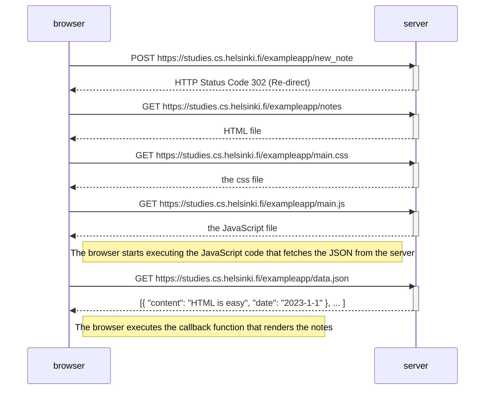
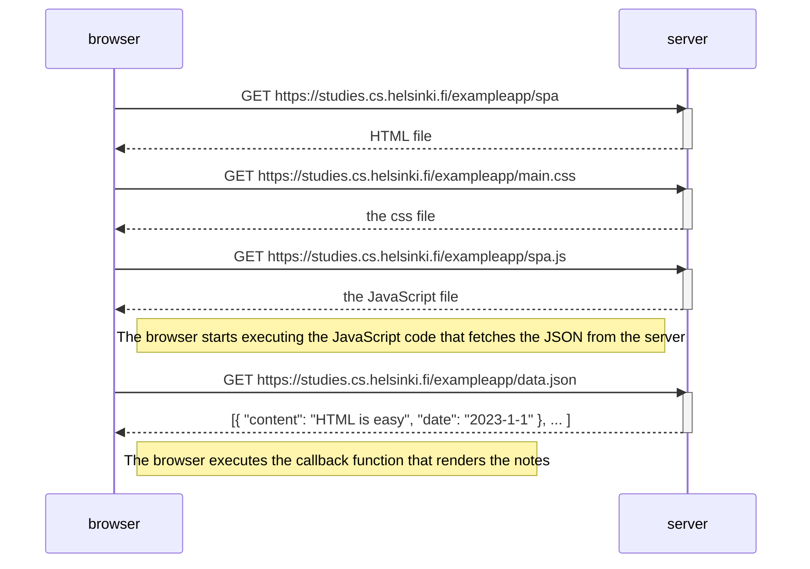
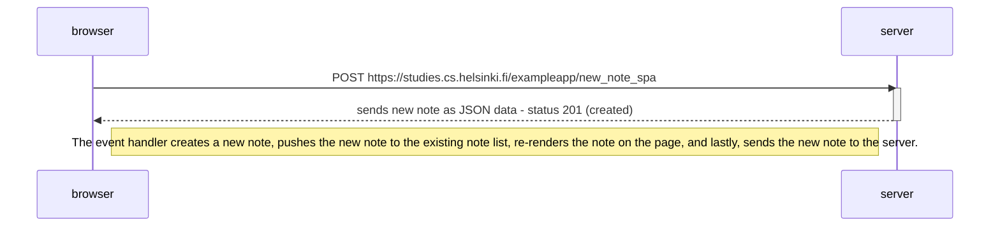

# Sean Jin - Submission for Part 0 - 2025

## 0.4: When a user submits/saves a note

## 0.4: When a user goes to the SPA version of the notes app

## 0.4: When a user submits a new note in SPA notes application

